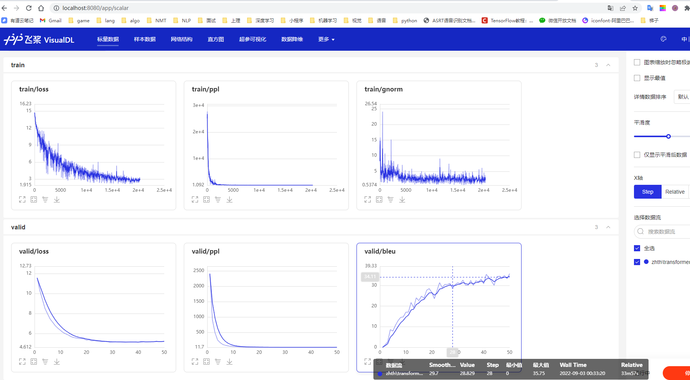
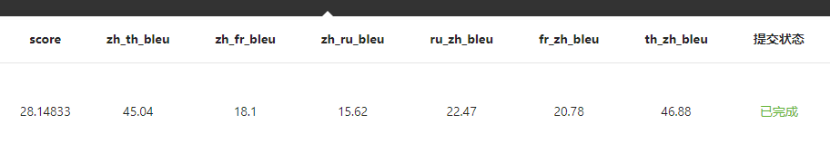
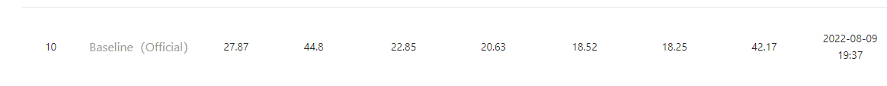

# 2022 IKCEST第四届“一带一路”国际大数据竞赛Paddle基线

## 1.Background

[2022 IKCEST第四届“一带一路”国际大数据竞赛](https://aistudio.baidu.com/aistudio/competition/detail/477/0/introduction)

本届大数据竞赛在中国工程院、教育部高等学校大学计算机课程教学指导委员会及丝绸之路大学联盟的指导下由联合国教科文组织国际工程科技知识中心（IKCEST）、中国工程科技知识中心（CKCEST）、百度公司及西安交通大学共同主办，旨在放眼“一带一路”倡议沿线国家，通过竞赛方式挖掘全球大数据人工智能尖端人才，实现政府—产业—高校合力推动大数据产业研究、应用、发展的目标，进一步夯实赛事的理论基础与实践基础，加快拔尖AI创新人才培养。

## 2.Usage

**0.Requirements**

```shell
git clone https://github.com/MiuGod0126/PaddleSeq.git
cd PaddleSeq
pip install -r requirements.txt
git clone https://github.com/MiuGod0126/nmt_data_tools.git
pip install -r nmt_data_tools/requirements.txt
```

**1.Prepare Data**

```shell
# 7mins
bash examples/ikcest22/scripts/prepare-ikcest22.sh
```

**2.Training Scripts**

default model: transformer_base

```shell
#eg1: train zh->th (default 50epoch)
export PYTHONWARNINGS='ignore:semaphore_tracker:UserWarning'
python paddleseq_cli/train.py -c examples/ikcest22/configs/zh_th.yaml --update-freq 4
# other configs
ls examples/ikcest22/configs/
# fr_zh.yaml  ru_zh.yaml	th_zh.yaml  zh_fr.yaml	zh_ru.yaml  zh_th.yaml
```

```shell
#eg2: train 6 directions, zh<-> th/fr/ru (10h)
bash examples/ikcest22/scripts/train_all.sh
```

```shell
# eg3: resume training from checkpoint
# replace epoch_xx to your checkpoint dir
python paddleseq_cli/train.py -c output/ckpt_zhth/epoch_xx/model.yaml
```

**3. Evaluation Scripts**

```shell
#eg1: evaluate zh->th (default ckpt: output/ckpt_zhth/epoch_final)
python paddleseq_cli/generate.py -c examples/ikcest22/configs/zh_th.yaml --pretrained output/ckpt_zhth/epoch_final --test-pref datasets/bpe/zh_th/valid

```

```shell
#eg2 : average checkpoints (k=2)
# There must be at least k models_best_xx under path "output/ckpt_zhth/"
python scripts/average_checkpoints.py --inputs output/ckpt_zhth/ --output output/ckpt_zhth/avg2 --num-ckpts  2
```

```shell
#eg3: visualize zh->th training curve
visualdl --logdir output/vislogs/zhth --port 8080 
# http://localhost:8080/app/scalar
```



```shell
#eg4: evaluate 6 directions, zh<-> th/fr/ru
bash  examples/ikcest22/scripts/evaluate_all.sh
```

**4. Generation Scripts**

```shell
#eg1: generate zh->th (default data: test.zh_th.zh; ckpt: output/ckpt_zhth/epoch_final)
## generate
python paddleseq_cli/generate.py -c examples/ikcest22/configs/zh_th.yaml --pretrained output/ckpt_zhth/epoch_final --only-src
## extract result
cat output/generate.txt | grep -P "^H" | sort -V | cut -f 3- > zh_th.rst
head zh_th.rst
```

```shell
#eg2:  generate 6 directions, zh<-> th/fr/ru
bash examples/ikcest22/scripts/generate_all.sh
```

**5.Submit Result**

this repo baseline:



official baseline:



[submit-result](https://aistudio.baidu.com/aistudio/competition/detail/477/0/submit-result)


## 3.Aistudio⭐

[2022 IKCEST第四届“一带一路”国际大数据竞赛Paddle基线](https://aistudio.baidu.com/aistudio/projectdetail/4490787)